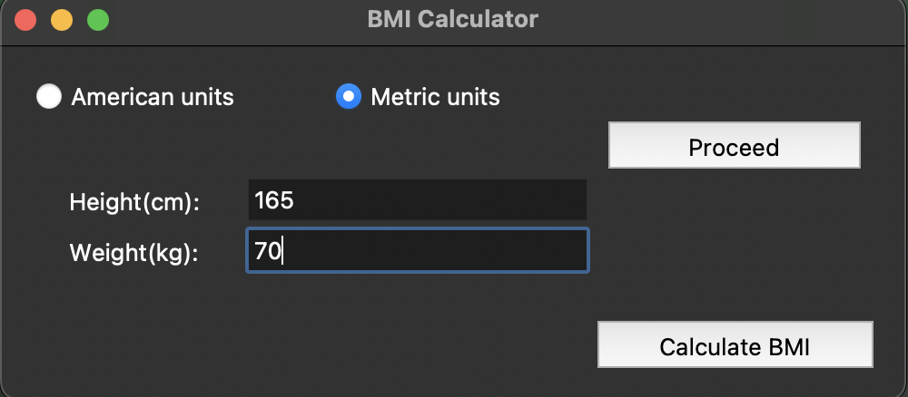
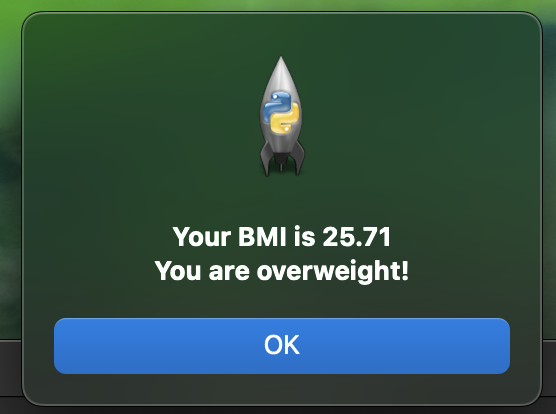

# BMI Calculator

A simple Python application for calculating Body Mass Index (BMI) using either American (imperial) or Metric units. Built with `tkinter` for an intuitive graphical user interface.

## Features

- **Dual Unit Support:** Calculate BMI using American (feet, inches, pounds) or Metric (centimeters, kilograms) units.
- **User-Friendly GUI:** Easy-to-use interface for input and results.
- **Weight Status Classification:** Displays BMI and categorizes weight status (underweight, healthy, overweight, obese).

## How to Use

1. **Run the Application:**
   - Ensure Python is installed on your system.
   - Download the script and run it using Python.

2. **Select Unit System:**
   - Choose either "American units" or "Metric units" using the radio buttons.

3. **Enter Details:**
   - For American units: Input height in feet and inches, and weight in pounds.
   - For Metric units: Input height in centimeters and weight in kilograms.

4. **Calculate BMI:**
   - Click the "Calculate BMI" button to view your BMI and weight status.

## Screenshots

## Screenshots





## Installation

1. Clone the repository or download the script.
2. Run the script using Python:

   ```bash
   python bmi_calculator.py
